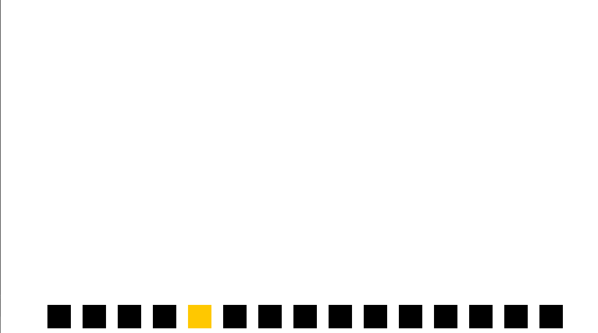
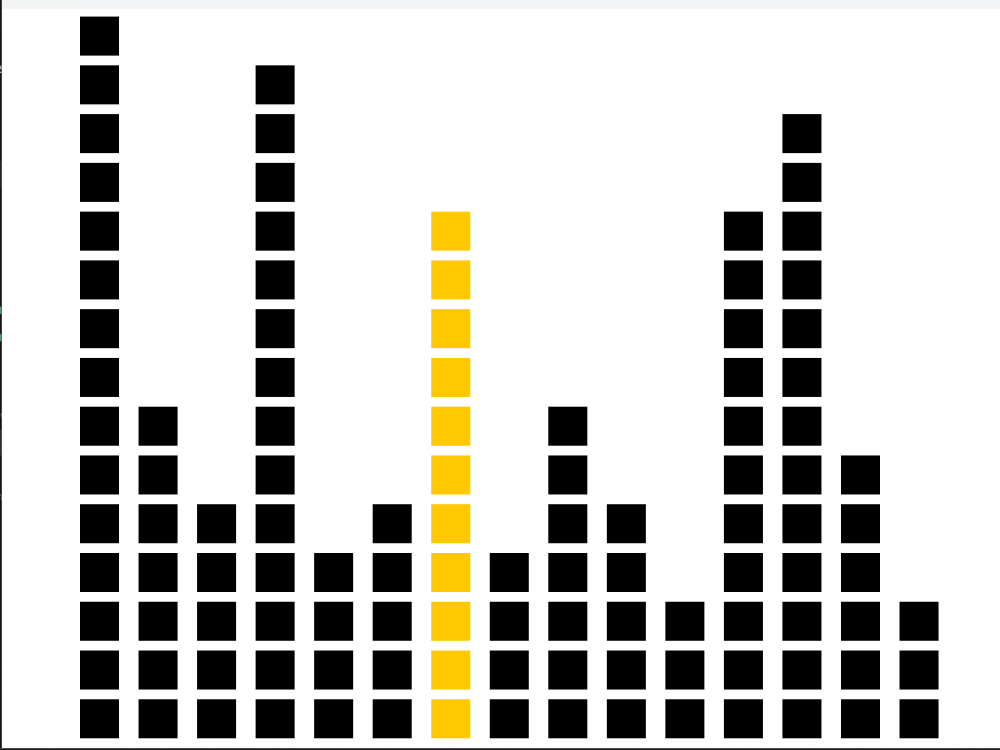

# Reto de arte generativo

### Efecto visual buscado

- Quiero generar una especie de arte modular pero con cubos asi como ondas de sonido vectorial o como en un ecualizador digital, de este estilo:


- Una fila de cuadrados base en la parte inferior de la pantalla.

- El usuario puede recorrerlos con la tecla d y apilar nuevos cuadrados con la tecla a y con la tecla s puede desapilarlos.

Visualmente, se crean torres de cuadrados encima de la base, y el cuadrado seleccionado se resalta de un color para saber donde estamos parados.

Asi podemos dar un efecto como de pixel art de musica bien bacano.

## Proceso del codigo 

Primero necesito crear una fila de cuadrados para que de ahí se pueda recorrer y ps ir apilando nuevos por lo que voy a crear una fila de nodos con el metodo push_back para guardar la cantidad necesaria dentro de `filaCuadrados` en la parte de abajo de la pantalla y los vamos a recorrer y dibujar:

ofApp.h
```cpp
#pragma once
#include "ofMain.h"

class ofApp : public ofBaseApp {
public:
	void setup();
	void update();
	void draw();

	std::vector<ofVec2f> filaCuadrados; // posiciones base
};
```

ofApp.cpp

```cpp
#include "ofApp.h"

void ofApp::setup() {
    ofBackground(255,255,255);
    int numBase = 15; 
    for (int i = 0; i < numBase; i++) {
        float x = 80 + i * 60;
        float y = ofGetHeight() - 60;
        filaCuadrados.push_back(ofVec2f(x, y));
    }
}

void ofApp::update() {

}

void ofApp::draw() {
    ofSetColor(255);
    for (auto &pos : filaCuadrados) {
        ofDrawRectangle(pos.x, pos.y, 40, 40);
    }
}

```

Ahora intentaremos vamos a intentar realizar el codigo de moverme entre los cuadrados con la tecla `d` y resaltar en el que estoy:

Listo, lo que hicimos fue esto, primero agregamos estas dos lineas al archivo ofApp.h:

```cpp
void keyPressed(int key);

int standingThis;
```
y la logica que tiene el ofApp.cpp es la siguiente con la estructura del boton `d` y el poner de diferente color en el que estoy parado: 
```cpp
void ofApp::draw() {
	for (int i = 0; i < filaCuadrados.size(); i++) {
		if (i == standingThis) {
			ofSetColor(255, 200, 0);			
		} else {
			ofSetColor(0);
		}
		stacks[i]->display();
	}
}

void ofApp::keyPressed(int key) {
	if (key == 'd') {
		standingThis = standingThis + 1;
		if (standingThis >= filaCuadrados.size()) {
			standingThis = 0;
		}
```
Evidencia:



Ya que podemos seleccionar el cuadro y movernos entre todos los de la base lo que haremos es agregar Nodos para poder apilarlos y asi darle el proposito al programa, para esto si tenemos que agregar ya muchas cosas, toda la estructura de pila lo que es el `push()` el `pop()` y el `display()` y `clear()`, para poder apilarlos en orden ascendente y des apilarlos en orden descendente lo que permite que podamos dar este efecto de apilar nuevos bloques, tambien tenemos que agregar funciones como las de la tecla `a` y la tecla `s` que se presentaran enseguida.

ofApp.h:

```cpp
#pragma once
#include "ofMain.h"

struct Node {
	ofVec2f position;
	Node* next;
	Node(float x, float y) {
		position.set(x, y);
		next = nullptr;
	}
};
class Stack {
public:
	Node * top;

	Stack() {
		top = nullptr;
	}

	~Stack() {
		clear();
	}

	void push(float x, float y) {
		Node * newNode = new Node(x, y);
		newNode->next = top;
		top = newNode;
	}

	void pop() {
		if (top != nullptr) {
			Node * temp = top;
			top = top->next;
			delete temp; // Liberar memoria del nodo eliminado
		}
	}

	void clear() {
		while (top != nullptr) {
			pop();
		}
	}

	void display() {
		Node * current = top;
		while (current != nullptr) {
			ofDrawRectangle(current->position.x, current->position.y, 40, 40);
			current = current->next;
		}
	}

	int height() {
		int h = 0;
		Node * current = top;
		while (current != nullptr) {
			h++;
			current = current->next;
		}
		return h;
	}
};
class ofApp : public ofBaseApp {
public:
	void setup();
	void update();
	void draw();
	void keyPressed(int key);
	void exit();

	std::vector<ofVec2f> filaCuadrados; // posiciones base
	int standingThis;
	vector<Stack *> stacks;
};

```
ofApp.cpp:
```cpp
#include "ofApp.h"


void ofApp::setup() {
	ofBackground(255,255,255);
	ofSetFrameRate(60);

	int numBase = 15; // cantidad de cuadrados en la fila
	

	for (int i = 0; i < numBase; i++) {
		float x = 80 + i * 60;
		float y = ofGetHeight() - 60;
		filaCuadrados.push_back(ofVec2f(x, y));

		Stack * newStack = new Stack();
		// Cada pila arranca con su base
		newStack->push(x, y);
		stacks.push_back(newStack);
	}
}

void ofApp::update() {
}


void ofApp::draw() {
	for (int i = 0; i < filaCuadrados.size(); i++) {
		if (i == standingThis) {
			ofSetColor(255, 200, 0);			
		} else {
			ofSetColor(0);
		}
		stacks[i]->display();
	}
}

void ofApp::keyPressed(int key) {
	if (key == 'd') {
		standingThis = standingThis + 1;
		if (standingThis >= filaCuadrados.size()) {
			standingThis = 0;
		}
	} else if (key == 'a') { // Apilar encima
		float x = filaCuadrados[standingThis].x;
		float y = filaCuadrados[standingThis].y - (stacks[standingThis]->height() * 50);
		stacks[standingThis]->push(x, y);
	} else if (key == 's') { // Desapilar (pero sin quitar la base)
		if (stacks[standingThis]->height() > 1) {
			stacks[standingThis]->pop();
		}
	}
}

void ofApp::exit() {
	for (Stack * s : stacks) {
		delete s;
	}
	stacks.clear();
}

```

### ¿Como se gestiona la memoria?
Como estamos creando datos con new para crear el Nodo tenemos que eliminar la memoria si o si por que queda en la memoria dinamica por eso el en `pop()` usamos el `delete` y el `clear` al hacer `exit()`.

### ¿como se interacciona con el programa? 
La idea es que el usuario pueda apilar las columnas y desapilarlar en el orden que quiera, aunque si siento que falta algo mas de dinamismo en la apliación para que se sienta mas creativo.


### Evidencias



### Video:


[Reto 04 video](https://www.youtube.com/watch?v=mxRRdPdie2A)