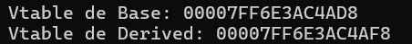
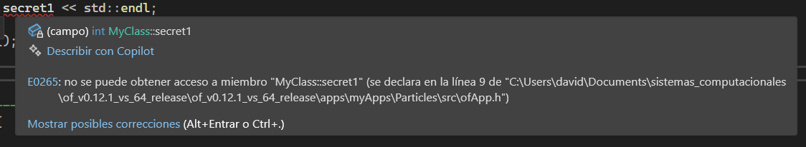

# Experiencia de aprendizaje 5: Programación Orientada a Objetos

## Sesión 1: la naturaleza de los objetos en C++

### Introducción a los Objetos

Concepto: un objeto es una instancia de una clase que combina datos (atributos) y comportamiento (métodos).

Considera el siguiente caso de estudio:

```cpp
class Particle {
public:
    float x, y;
    void move(float dx, float dy) {
        x += dx;
        y += dy;
    }
};
```
¿Qué representa la clase Particle?

Representa las posiciones y el movimiento del objeto particula.

¿Cómo interactúan sus atributos y métodos?

El método mueve guarda las posiciones de las partículas.

### Explorando la memoria

**¿Los atributos están almacenados de forma contigua?**

Sí, porque el primer atributo se crea en la primera posicion indicada y el segundo osea `y`se crea en el espacio que le sigue pero no separado de manera lineal.

**¿Qué indica el tamaño del objeto sobre su estructura interna?**

Su cantidad de atributos y el tipo de atributos que este tiene.

## Análisis de diferencias

### Crear clases con diferentes atributos y métodos:

```c++
class StaticData {
public:
    static int s;
    int a;
};

int StaticData::s = 0;

class DynamicData {
public:
    int* ptr;
    DynamicData() {
        ptr = new int[10];
    }
    ~DynamicData() {
        delete[] ptr;
    }
};
```

**¿Cómo afectan los datos estáticos al tamaño de la instancia?**

Estos tipos de datos no afectan el tamaño de la memoria ya que estan guardados en `.data` y no en el `Stack` .

**¿Qué diferencias hay entre datos estáticos y dinámicos en términos de memoria?**

Los datos estaticos se guardan en el `bss` o en `data` y tienen una ubicación fija, y una ves guardado no se puede cambiar durante la ejecución y casi siempre se usa para cuando tenemos datos fijos. En cambio los datos dinamicos se almacenan en el `heap`, y se puede liberar o pedir memoria mientras el programa este en ejecución, y el tamaño se ajusta a lo que se necesite en una situación especifica.

### Reflexión

**¿Qué es un objeto desde la perspectiva de la memoria?**

Es una estructura que guarda metodos, y atributo, en memoria es un bloque contiguo reservado tanto en el `Heap` como en el `Stack` dependiendo de como lo creemos o lo declaremos, los atributos se guardan en este bloque que estamos hablando pero los metodos van en otra parte de la memoria conocida como segmento code.

**¿Cómo influyen los atributos y métodos en el tamaño y estructura del objeto?**

El tamaño de un objeto seran la suma de sus atributos y ps los metodos normales que en este momento son los que estamos trabajando no se guardan en el objeto si no que se guardan en otro punto de la memoria. 

**Conclusión: resumir los hallazgos y cómo esto impacta el diseño de clases.**

Un objeto esta compuesto de atributos y estos definen su tamaño en memoria, los metodos no incrementan el tamaño de un objeto ya que esta parte del codigo se guarda aparte y es compartido por las instancias y los atributos se guardan de forma contigua.


# Sesion 2

**Pront ChatGPT:¿Dónde se almacenan los datos y métodos de una clase en C++ en la memoria? Explica el concepto de vtable y cómo se relaciona con los métodos virtuales.**

Atributos (variables miembro no estáticas):

- Los atributos de instancia (no estáticos) se almacenan dentro de cada objeto, normalmente en el heap (si el objeto se crea con new) o en la pila (stack) (si el objeto es local en una función).

- El orden en memoria de los atributos depende del compilador, pero en general siguen el orden de declaración en la clase (aunque puede haber padding por alineación).

Atributos estáticos:

- Se almacenan en una sola ubicación, en la zona de datos estáticos del programa, compartidos por todas las instancias de la clase.

Métodos (funciones miembro no virtuales):

- El código de los métodos vive en la sección de código (text segment) del programa.

- Todas las instancias de la clase comparten ese mismo código.

Métodos virtuales:

- Aquí entra el concepto de la vtable (virtual table).

**¿Cómo funciona?**

**Clase con métodos virtuales:**
El compilador genera una vtable con punteros a las funciones virtuales que correspondan a esa clase.

**Objeto de la clase:**
Cada objeto de una clase con métodos virtuales lleva "oculto" un puntero llamado vptr (virtual pointer), que apunta a la vtable de su clase.

**Despacho dinámico:**

- Cuando llamas a un método virtual mediante un puntero o referencia a la clase base, el compilador consulta el vptr → que apunta a la vtable → y selecciona la función adecuada.

- Así se logra el polimorfismo dinámico: que el método ejecutado dependa del tipo real del objeto en tiempo de ejecución.

## Exploracion de motodos virtuales

**¿En qué parte de la memoria se encuentran las vtable de cada objeto?**



Se guarda en D8 el de base y sigue asi `D9, DA, DB, DC, DD, DE, DF, F0, F1, F2, F3, F4, F5, F6, F7, F8` por lo que entendemos que pesa 16 bytes y pertecen a la parte de la memoria virtual de `read only data` ya que son los vtable osea las tablas que contienen las funciones y cada objeto tiene un vptr que apunta a estos arrays.

**¿Cómo afecta la presencia de métodos virtuales al tamaño del objeto?**

Hagamos una prueba con 
```cpp
std::cout << "Tamaño de Base: " << sizeof(Base) << " bytes" << std::endl;
std::cout << "Tamaño de Derivada: " << sizeof(Derived) << " bytes" << std::endl;
```
Mirando los resultados nos damos cuenta que, cada clase pesa 8 bytes ¿por que?, ya que solo las clases tienen los metodos virtuales que se crean automaticamente al manejar este tipo de funciones y cada uno de estos punteros pesa 8 bytes (ambos objetos solo tienen el vptr)

**¿Qué papel juegan las vtables en el polimorfismo?**

Realice un experimento:

```cpp
class Animal {
public:
	virtual void display() {
		std::cout << "Hacer sonido" << std::endl;
	}
};

class Perro : public Animal {
public:
	void display() override {
		std::cout << "Guau" << std::endl;
	}
};

class Gato : public Animal {
public:
	void display() override {
		std::cout << "Miau" << std::endl;
	}
};
```

y este es lo que me muestra cuando llamo la misma funcion pero desde un objeto diferente con:

```cpp
b.display();
d.display();
d2.display();
```


Osea que cada objeto tiene un vptr que apunta hacia el vtable de cada clase, y esto hace que no se llame directamente el metodo de la clase si no que consulta el vptr del objeto y este lo lleva al vtable y este ya selecciona el metodo correspondiente al puntero.

**¿Cómo se implementan los métodos virtuales en C++?**

- Los métodos virtuales se implementan con vptr (puntero oculto en cada objeto) y vtable (tabla estática por clase).

- Cada llamada a un método virtual consulta esa vtable en tiempo de ejecución.

- Esto habilita el polimorfismo dinámico en C++.

## Uso de punteros y referencias

**Observar si el tamaño de la instancia cambia al usar punteros a funciones.**

Si cambia ya que si tenemos una instancia que solo cuenta con una funcion su peso seria de 1 byte pero como este tiene un puntero a funcion su tamaño en memoria es de 8 bytes.

**Verificar cómo se almacenan estos punteros.**

Ps como el metodo es static va hacia .text y el puntero se guarda dentro del objeto y ya depende de si esta en el heap en el stack o en el global.

**¿Cuál es la relación entre los punteros a métodos y la vtable?**

La relación que tienes es que ambos punteros son particulares de cada objeto, y se necesita de un objeto para saber a que metodo se esta llamando.

**¿Cómo afectan estos mecanismos al rendimiento del programa?**

En terminos de rendimiento es más pesado el vtable que los punteros a metodos pero es mas trabajo al punto de programar los punteros a metodos aunque de alguna manera mas facil de entender, ya que un puntero apunta a un metodo y no se usa toda la terminologia de vptr que se crea por debajo en el programa y lo que apunta a un vtable.

### Prompt ChatGPT: ¿Qué diferencia hay entre punteros a funciones y punteros a métodos miembro en C++? ¿Cómo afectan al tamaño de los objetos y al rendimiento?

- Punteros a funciones → simples direcciones, tamaño fijo (1 puntero), overhead mínimo.

- Punteros a métodos miembro → contienen más información (dirección + posibles offsets + virtual dispatch), su tamaño puede ser mayor, y pueden introducir un overhead de resolución en tiempo de ejecución.

- Impacto en objetos → la existencia de métodos virtuales añade un puntero oculto (vptr) a cada instancia, mientras que tener punteros a funciones o métodos solo afecta a las variables que los usan, no a los objetos de esa clase.

## Reflexion individual: 

### ¿Dónde residen los datos y métodos de una clase en la memoria?

Depende de los datos:

Atributos normales se guardan en el `heap` o en el `stack` y viven dentro del objeto.

Los atributos estaticos en cambio se guardan solo una vez en memoria y estan en la .data si son inicializados y entan en .bss si no se inicializaron.

los metodos no virtuales se guardan en el .text y no apotan peso en bytes respecto a la clase o al objeto, los metodos virtuales en cambio necesitan de vtables y cada objeto crea o guarda un puntero oculto que se llama `vptr` y este si guarda peso en el objeto.

### ¿Cómo interactúan las diferentes partes en tiempo de ejecución?

Ps para la creacion de un objeto ponemos por ejemplo `Animal a` y este ya queda con los atributos del objeto y con sus metodos, luego para llamar un atributo se usa `a.patas = 4` y el compilador busca donde esta este atributo accede a ese dato y lo sobreescribe, llamamos un metodo normal con `a.correr()` y este va a el .text y ejecuta la instruccion, y para acceder a un metodo virtual tenemos que buscar y llamar al puntero vptr y le decimos que apunte al metodo que esta en la vtable.

### Sesion 3

> Prompt para ChatGPT:  ¿Cómo implementa el compilador el encapsulamiento en C++? Si los miembros privados aún ocupan espacio en el objeto, ¿Qué impide que se acceda a ellos desde fuera de la clase?

**Respuesta**

En C++, el encapsulamiento no es una cuestión de memoria, sino de reglas de acceso impuestas por el compilador:

Todos los atributos (públicos, privados o protegidos) ocupan espacio en el objeto de la misma manera.
👉 Un int privado ocupa lo mismo que un int público.

La diferencia está en que el compilador revisa si el código que intenta acceder a esos miembros lo hace desde un contexto permitido (dentro de la clase, desde una función amiga, etc.).
👉 Si no está permitido, el compilador da un error en tiempo de compilación.

Ejemplo:
```cpp
class Persona {
private:
    int edad;   // privado
public:
    void setEdad(int e) { edad = e; } 
};

int main() {
    Persona p;
    p.edad = 30;  // ❌ Error: 'edad' is private
}

```

### 2. ¿Qué impide que se acceda de todas formas?

Nada mágico sucede en la memoria. Lo que pasa es:

El compilador traduce nombres de miembros a offsets dentro de la estructura del objeto.
Por ejemplo, p.edad puede estar en &p + 0x4.

Si intentas acceder directamente, no tienes forma de calcular ese offset en el código normal de C++ porque el compilador no te deja.

👉 Sin embargo, si usas punteros y reinterpret_cast, puedes "romper" el encapsulamiento:

```cpp
#include <iostream>
using namespace std;

class Persona {
private:
    int edad;
public:
    Persona(int e): edad(e) {}
};

int main() {
    Persona p(25);

    // Hack: reinterpretamos la dirección del objeto como un int*
    int* ptr = (int*)&p;
    cout << "Edad (hackeada): " << *ptr << endl;  // imprime 25
}
```
Esto funciona porque los datos están ahí físicamente, y C++ no impone barreras en tiempo de ejecución (a diferencia de Java o C#, donde hay más verificaciones en runtime).

### 3. Conclusión

El encapsulamiento en C++ es una convención del compilador, no un mecanismo de protección en memoria.

Todos los miembros (privados, públicos, protegidos) ocupan espacio igual en la instancia.

Lo que impide el acceso es la verificación del compilador en tiempo de compilación.

Con punteros y casting es posible "saltarse" el encapsulamiento, pero eso se considera malas prácticas y rompe la seguridad del diseño.

## punto 3

Mirando el ejercicio planteado nos damos cuenta que:



Y contiene un error por el tipo de encapsulamiento que tiene.


**¿Qué es el encapsulamiento y cuál es su propósito en la programación orientada a objetos?**

El encapsulamiento es como agrupar en una clase los datos, atributos y metodos y restringirles el acceso a cambios externos, esto ayuda a proteger datos que no queremos que otra clase o metodo nos cambie, la implementacion jamas se conoce del todo, y controlamos mas facil el acceso a nuestros atributos.

**¿Por qué es importante proteger los datos de una clase y restringir el acceso desde fuera de la misma?**

Por que de esta manera evitamos errores accidentales al mover los valores de una clase desde otro lado, asi la clase es la que controla cuando y donde se cambian los datos, y se puede proteger informacion que no queremos que se cambia o se acceda a ella sin un debido control.


