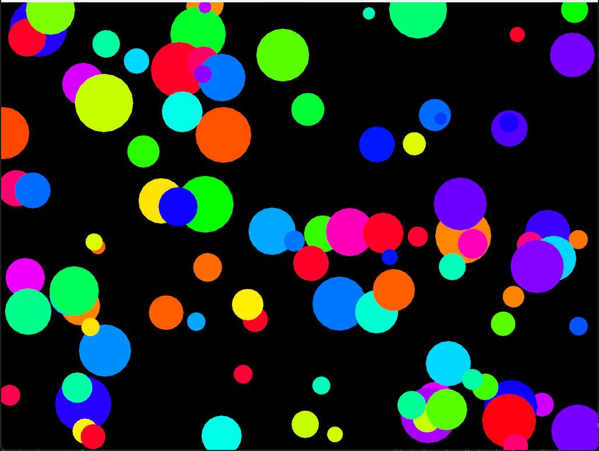

# Reto 

Lo que quiero desarrollar es un programa que tenga una clase base circulo y en si la funcionalidad es que cada circulo creado como subclase tenga una funcionalidad diferente o se muevan diferente.

Hoy empecé con la base del proyecto. Quise que todos mis circulos compartieran un mismo "molde" o "base", así que hice una clase abstracta Shape.

Me equivoqué porque primero puse los atributos como public y luego me di cuenta de que debía protegerlos (protected) para practicar encapsulamiento.

```cpp

#pragma once
#include "ofMain.h"

class Circulo {
protected: 
    ofPoint position;
    float size;

public:
    Circulo(float x, float y, float s) : position(x, y) , size(s) { }

    virtual void update();
    virtual void draw();
};
```

Así cree la base de nuestros circulos, con los datos que va a tener y su propio constructor para que al crear el objeto venga con estos datos de la clase Base, tambien añadi 2 metodos uno de dibujar y otro de actualizar y los volvi virtuales por que mis subclases tienen que tener estos metodos para poder que hagan la funcionalidad que planteo.

Ahora vamos a realizar uno de los circulos, creo que seria uno que cambia de color ya que hemos estado trabajando varias b¿veces en el curso con cambios de color y cosas asi.

Empecé mal porque traté de cambiar solo color.r, pero no se veía el efecto. Después descubrí que también debía modificar g y b para que el cambio fuera visible.

Ahora si al poder mostrarlo en el cpp de esta manera, creando 100 circulos de cada uno ps es la idea y llamando los metodos virtuales por medio de la direccion con `circulo->...();`:

```cpp
void ofApp::setup(){

  ofBackground(0);
    int numCircles = 100; // cantidad de círculos

    for (int i = 0; i < numCircles; i++) {
        float x = ofRandomWidth();
        float y = ofRandomHeight();
        float size = ofRandom(10, 50);
        float speed = ofRandom(1, 5);

        circulos.push_back(new CirculoColor(x, y, size, speed));
    }
    
}


//--------------------------------------------------------------
void ofApp::update(){
    for (auto circulo : circulos) {
        circulo->update();
    }
}

//--------------------------------------------------------------
void ofApp::draw(){
    for (auto c : circulos) 
        c->draw();
    
}

//--------------------------------------------------------------
void ofApp:: exit() {
    for (auto c : circulos)
        delete c;
    circulos.clear();
}
```

tambien probando cosas diferentes si cambiamos al speed a un numero mas bajo se me algo mas tranquilo en los colores y no tan estranbotico:

> Un problema que me causo lio al momento de correr el programa era que primero no habia creado un destructor para la clase `Circulo` y no habia empleado el metodo virtual `draw()` para cada subclase lo que me dañaba el codigo y ps no se llegara a dibujar nada




Aqui se puede ver como se crean circulos en partes randoms de la pantalla y tambien con los colores y asi damos por terminado la primera sub clase del programa, lo mas importante es tener bien mi clase base bien ya que el resto solo es molde y implementacion y sobreescritura de los metodos.

### Sub clase 2

Bueno ahora estaba pensando en realizar una subclase de circulo que funcione como si rebotara en la pantalla algo que me recordo mucho a como funcionaba el salva pantallas en los computadores que usaba antes, por lo que lo primero que cree fue:

```cpp
class CirculoRebote : public Circulo {
    ofVec2f velocity;

public:
    CirculoRebote(float x, float y, float s, float spd)
        : Circulo(x, y, s)
        , velocity(ofRandom(-2, 2), ofRandom(-2, 2)) { }

}
```

Que es el constructor de esta clase, y le damos valores a la velocidad aleatorios entre -2 y 2 tanto en `x` como en `y` para que estas cuando se creen vayan a direcciones diferentes.
Ahora lo duro sera pensar en como el circulo va a chocar contra las paredes, lo que podriamos hacer es usar la funcion de OpenFrameWoks `ofGetWidth()` que lo que hace es que me devuelve el tamaño de la ventana y otra cosa super importante es que el origen de mis coordenadas no es en el centro de mi pagina, es en la esquina izquierda superior.
```cpp
void update() override {
    position += velocity;
    if (position.x < 0 || position.x > ofGetWidth()) velocity.x *= -1;
    if (position.y < 0 || position.y > ofGetHeight()) velocity.y *= -1;
}
``` 
Llegamos a esta solucion colocando estos 2 ifs donde se puede observar que si llega al extremo o a las cordenadas de origen su velocidad va a cambiar al multiplicarla por -1.

Evidencia de lo logrado:


se crearon 100 circulos y estos chocan contra las paredes tanto la de arriba y abajo como las de derecha y izquierda.

### Sub Clase 3
Ahora la subClase de circulo que quiero realizar es una que se pueda verse dentro de los circulos de colores y que respiren o palpiten osea que cambien su `size`, esta decicion la tome por que estaba realizando un codigo de unas pelotas que se movieran de derecha a izquierda peor senti que era muy poco original y no se veia muy bien asi que tome la decision de realizar esto y siento que le daria un efecto muy bacano a los circulos de colores.

Por lo que diseñamos una subclase con estos metodos sobreescritos:

```cpp
class CirculoRespira : public Circulo {
    float angle;

public:
    CirculoRespira(float x, float y, float s, float spd)
        : Circulo(x, y, s)
        , angle(0) { }

    void update() override {
        angle += 0.05;
        size = 20 + 10 * sin(angle); // efecto de respiración
    }

    void draw() override {
        ofSetColor(0, 0, 0);
        ofDrawCircle(position, size);
    }
};
```

y creamos los objetos en el ofApp.cpp de esta manera para ver nuestro resultado:


Con este ejercicio pude confirmar cómo el polimorfismo funciona: cada círculo tiene su propio `update()`, y aunque todos se guardan en un `vector<Circle*>`, cada uno se comporta distinto.

Tambien podemos ver como los atributos `ofPoint position; float size;` son protectet.

Y la herencia se da para copiar el `"molde"` que va a tener cada circulo y los metodos.

