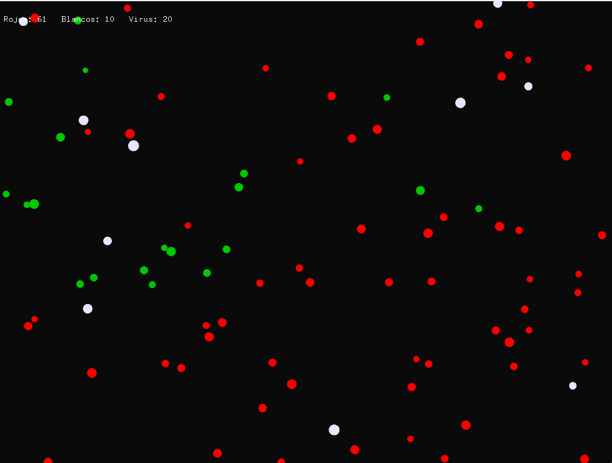
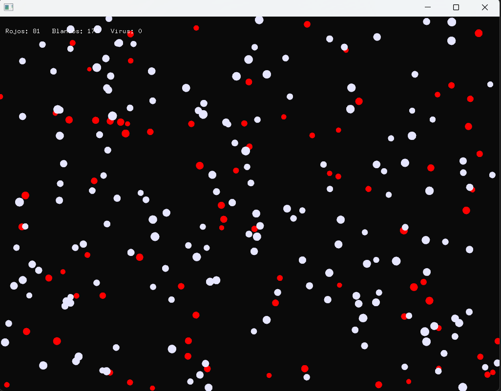

# Reto

Lo que quiero realizar es un sistema inmune que se va a encargar de contar con distintos tipos de celulas, son globulos rojos, globulos blancos, y el viruz.

la idea es que se puedan crear desde Factory cada celula y el evento serian tomar pastilla (este genera mas anticuerpos osea mas globulos blancos).

las particulas se van a mover por la pantalla, y cuando se toquen las celulas de color.

**Primera Parte**

Primero armé una plantilla que me permitiera actualizar y dibujar partículas en pantalla y definí las propiedades básicas que tendrian las particulas y con el codigo de la actividad pasada hice que cada partícula se mueva dentro de la ventana rebotando en los bordes.

Luego implemente el patron de diseño factory, este me permitio crear tres tipos esoecificos de particulas, las cuales son, "red" -->`globulos rojos`, "white" -->`globulos blancos`, "virus" -->`la enfermedad`.

lo implememte de esta manera:

```cpp
Particle * ParticleFactory::createParticle(const std::string & type) {
    Particle * p = new Particle();
    p->type = type;

    if (type == "white") {
        p->color = ofColor(255);
        p->size = 7;
        p->velocity = ofVec2f(ofRandom(-1, 1), ofRandom(-1, 1));
    } else if (type == "red") {
        p->color = ofColor(255, 0, 0);
        p->size = 6;
        p->velocity = ofVec2f(ofRandom(-1, 1), ofRandom(-1, 1));
    } else if (type == "virus") {
        p->color = ofColor(0, 255, 0);
        p->infected = true;
        p->size = 5;
        p->velocity = ofVec2f(ofRandom(-2, 2), ofRandom(-2, 2));
    }
    return p;
}

```

Y lo probe creando las pelotas y efectivamente si se crearon segun los parametros dados:

```cpp
for (int i = 0; i < 80; i++) particles.push_back(ParticleFactory::createParticle("red"));
for (int i = 0; i < 10; i++) particles.push_back(ParticleFactory::createParticle("white"));
particles.push_back(ParticleFactory::createParticle("virus"));
```

Para el patron observer necesitabamos que las particulas reacciones a eventos como `pill` y esta parte del codigo la reutilice del ejercicio pasado.

Luego nuestro en nuestro codigo implementamos el patron de States por medio de saber si esta en un estado normal y o en un estado enfermo:

```cpp
void NormalState::update(Particle * particle, std::vector<Particle *> & allParticles) {
	particle->position += particle->velocity * 1.0f;	
}


void InfectedState::update(Particle * particle, std::vector<Particle *> & allParticles) {
	particle->position += particle->velocity * 1.0f;
	particle->color = ofColor(0, 200, 0);
}
```

y se pasa de normal a infectado asi:
```cpp
void Particle::setState(State * newState) {
    delete state;
    state = newState;
}
```

Asi cuando un virus toca una particula roja la infecta pero si una particula blanca toca una verde se vuelve una roja.



Si presionamos mucho p o el codigo para que se creen mas globulos rojos.



**Reflexion**


Este proyecto me permitió experimentar cómo los patrones de diseño hacen que un sistema complejo se vuelva organizado, extensible y fácil de entender.

Factory me dio control total sobre cómo nacen las entidades.

Observer me permitió comunicar eventos sin acoplar el código.

State hizo que cada partícula tuviera comportamientos diferenciados.

**Todo el codigo**

ofApp.h:

```cpp
#pragma once

#include "ofMain.h"
#include <string>
#include <vector>


class Observer {
public:
	virtual void onNotify(const std::string & event) = 0;
};

class Subject {
public:
	void addObserver(Observer * observer);
	void removeObserver(Observer * observer);

protected:
	void notify(const std::string & event);

private:
	std::vector<Observer *> observers;
};


class Particle;


class State {
public:
	
	virtual void update(Particle * particle, std::vector<Particle *> & allParticles) = 0;
	virtual void onEnter(Particle * particle) { }
	virtual void onExit(Particle * particle) { }
	virtual ~State() = default;
};


class Particle : public Observer {
public:
	Particle();
	~Particle();

	void update(std::vector<Particle *> & allParticles);
	void draw();
	void onNotify(const std::string & event) override;
	void setState(State * newState);

	ofVec2f position;
	ofVec2f velocity;
	float size;
	ofColor color;

	std::string type;
	bool infected = false;

private:
	State * state;
};


class NormalState : public State {
public:
	void update(Particle * particle, std::vector<Particle *> & allParticles) override;
};

class InfectedState : public State {
public:
	void update(Particle * particle, std::vector<Particle *> & allParticles) override;
};

class ParticleFactory {
public:
	static Particle * createParticle(const std::string & type);
};


class ofApp : public ofBaseApp, public Subject {
public:
	void setup();
	void update();
	void draw();
	void keyPressed(int key);

private:
	std::vector<Particle *> particles;
};

```

**ofApp.cpp**

```cpp
#include "ofApp.h"
#include <algorithm>

void Subject::addObserver(Observer * observer) {
	observers.push_back(observer);
}

void Subject::removeObserver(Observer * observer) {
	observers.erase(std::remove(observers.begin(), observers.end(), observer), observers.end());
}

void Subject::notify(const std::string & event) {
	for (Observer * observer : observers) {
		observer->onNotify(event);
	}
}


Particle::Particle() {
	position = ofVec2f(ofRandomWidth(), ofRandomHeight());
	velocity = ofVec2f(ofRandom(-1, 1), ofRandom(-1, 1));
	size = ofRandom(4, 7);
	color = ofColor::white;
	infected = false;

	state = new NormalState();
	
}

Particle::~Particle() {
	delete state;
}

void Particle::setState(State * newState) {
	if (state != nullptr) {
		state->onExit(this);
		delete state;
	}
	state = newState;
	if (state != nullptr) {
		state->onEnter(this);
	}
}

void Particle::update(std::vector<Particle *> & allParticles) {
	if (state) state->update(this, allParticles);

	// rebote en bordes
	if (position.x < 0 || position.x > ofGetWidth()) velocity.x *= -1;
	if (position.y < 0 || position.y > ofGetHeight()) velocity.y *= -1;
}

void Particle::draw() {
	ofSetColor(color);
	ofDrawCircle(position, size);
}

void Particle::onNotify(const std::string & event) {
	
	if (event == "infection") {
		if (infected) {
			setState(new InfectedState());
		}
	}
}


void NormalState::update(Particle * particle, std::vector<Particle *> & allParticles) {
	
	particle->position += particle->velocity * 1.0f;

	
}


void InfectedState::update(Particle * particle, std::vector<Particle *> & allParticles) {
	particle->position += particle->velocity * 1.0f;
	
	particle->color = ofColor(0, 200, 0);

	
}


Particle * ParticleFactory::createParticle(const std::string & type) {
	Particle * p = new Particle();
	p->type = type;

	if (type == "white") {
		p->color = ofColor(230, 230, 255); 
		p->size = ofRandom(6, 9);
		p->velocity = ofVec2f(ofRandom(-1.0, 1.0), ofRandom(-1.0, 1.0));
		p->infected = false;
		p->setState(new NormalState());
	} else if (type == "red") {
		p->color = ofColor(255, 0, 0); 
		p->size = ofRandom(5, 8);
		p->velocity = ofVec2f(ofRandom(-1.0, 1.0), ofRandom(-1.0, 1.0));
		p->infected = false;
		p->setState(new NormalState());
	} else if (type == "virus") {
		p->color = ofColor(0, 200, 0); 
		p->size = ofRandom(4, 6);
		p->velocity = ofVec2f(ofRandom(-1.2, 1.2), ofRandom(-1.2, 1.2));
		p->infected = true;
		p->setState(new InfectedState());
	}
	return p;
}


void ofApp::setup() {
	ofBackground(10);
	ofSetFrameRate(60);

	
	for (int i = 0; i < 80; ++i) {
		Particle * p = ParticleFactory::createParticle("red");
		particles.push_back(p);
		addObserver(p);
	}

	
	for (int i = 0; i < 10; ++i) {
		Particle * p = ParticleFactory::createParticle("white");
		particles.push_back(p);
		addObserver(p);
	}

	
	Particle * virus = ParticleFactory::createParticle("virus");
	particles.push_back(virus);
	addObserver(virus);
}

void ofApp::update() {
	
	for (auto * p : particles) {
		p->update(particles);
	}

	
	const float contagionRadius = 36.0f; 
	const float cureRadius = 27.0f; 

	
	for (size_t i = 0; i < particles.size(); ++i) {
		for (size_t j = i + 1; j < particles.size(); ++j) {
			Particle * v = particles[i];
			Particle * r = particles[j];
			float dist = v->position.distance(r->position);

			if (v->type == "virus" && r->type == "red" && dist < contagionRadius) {
				
				r->type = "virus";
				r->infected = true;
				r->color = ofColor(0, 200, 0);
				r->setState(new InfectedState());
			}
			
			else if (r->type == "virus" && v->type == "red" && dist < contagionRadius) {
				v->type = "virus";
				v->infected = true;
				v->color = ofColor(0, 200, 0);
				v->setState(new InfectedState());
			}

			
			if (v->type == "white" && r->type == "virus" && dist < cureRadius) {
				
				r->type = "red";
				r->infected = false;
				r->color = ofColor(255, 0, 0); 
				r->setState(new NormalState());
			}
			
			else if (r->type == "white" && v->type == "virus" && dist < cureRadius) {
				v->type = "red";
				v->infected = false;
				v->color = ofColor(255, 0, 0);
				v->setState(new NormalState());
			}
		}
	}
}

void ofApp::draw() {
	for (auto * p : particles) {
		p->draw();
	}

	
	int countRed = 0, countWhite = 0, countVirus = 0;
	for (auto * p : particles) {
		if (p->type == "red")
			++countRed;
		else if (p->type == "white")
			++countWhite;
		else if (p->type == "virus")
			++countVirus;
	}

	ofSetColor(255);
	ofDrawBitmapString("Rojos: " + ofToString(countRed) + "   Blancos: " + ofToString(countWhite) + "   Virus: " + ofToString(countVirus), 12, 34);
}

void ofApp::keyPressed(int key) {
	if (key == 'p') {
		
		for (int i = 0; i < 10; ++i) {
			Particle * p = ParticleFactory::createParticle("white");
			particles.push_back(p);
			addObserver(p);
		}
		
	}
}

```

### Link de funcionamiento:
[Video reto 06](https://youtu.be/8fiCmamHJU8)


   
