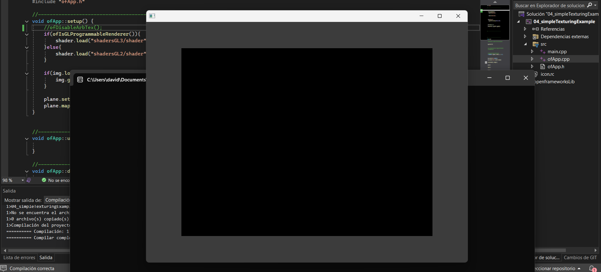
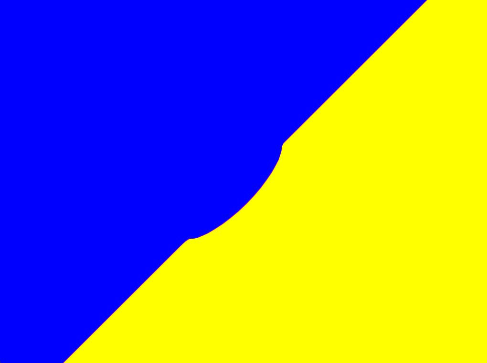
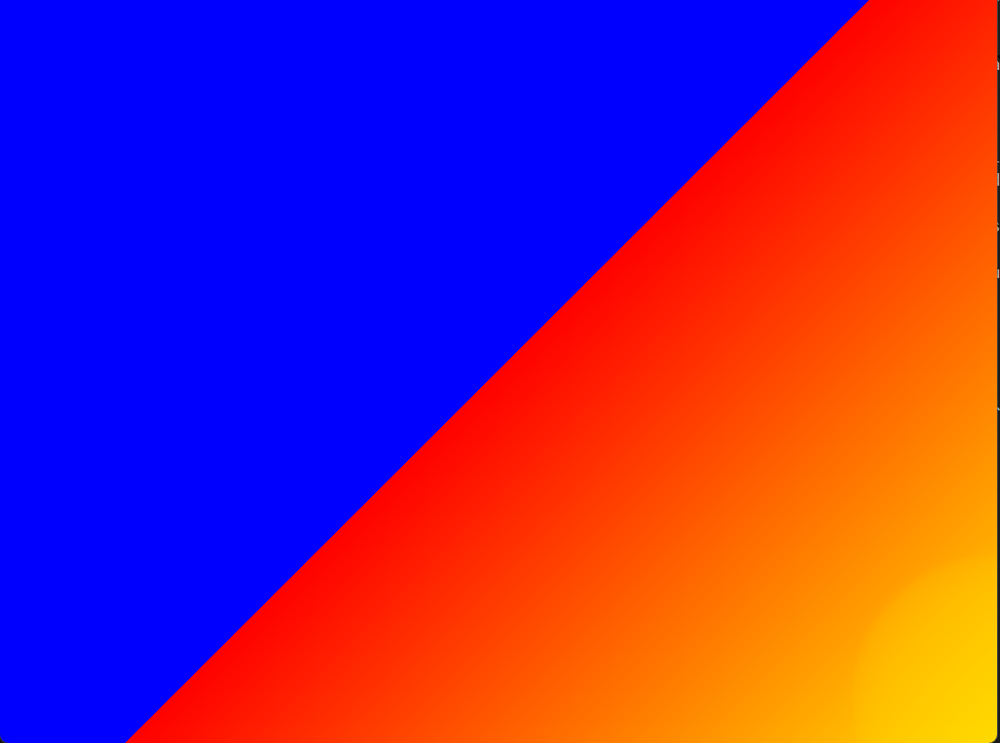
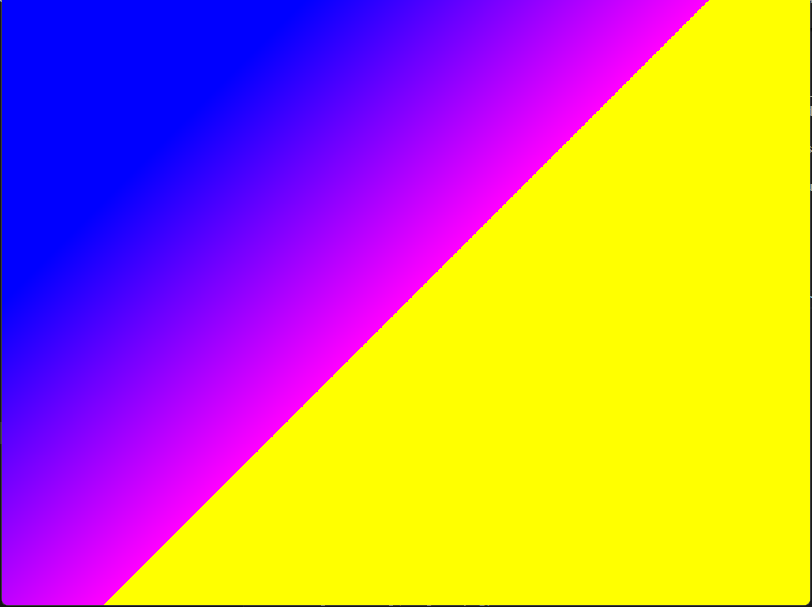
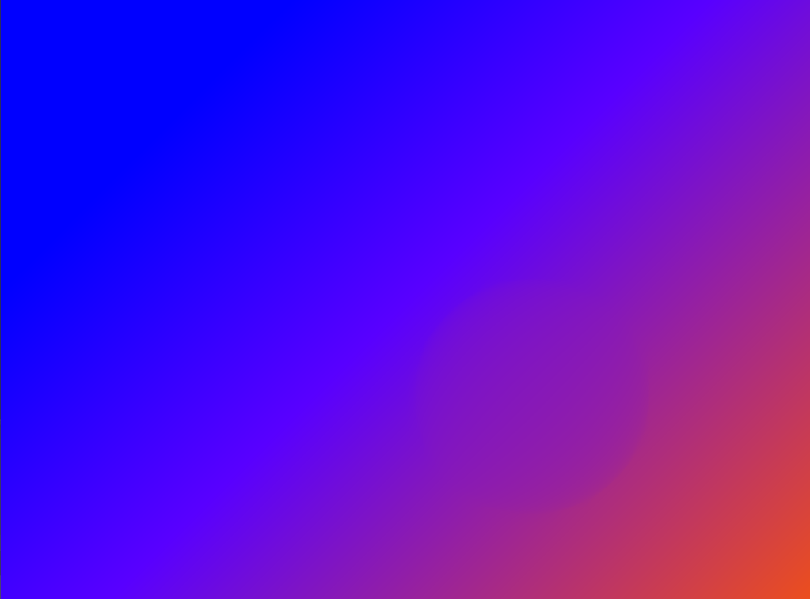
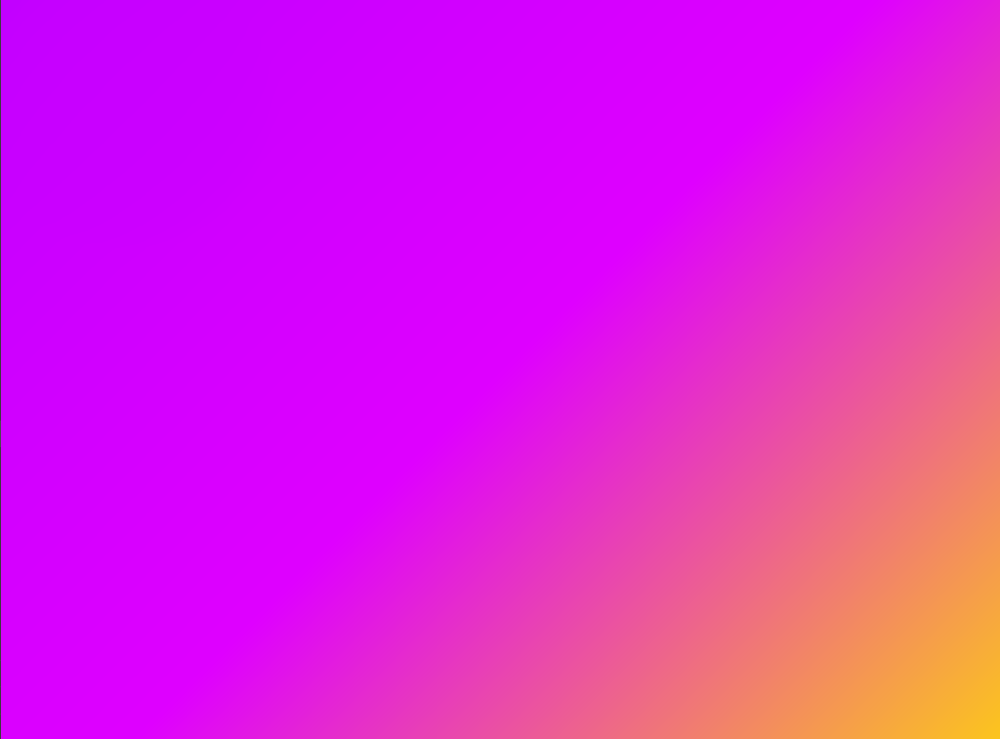
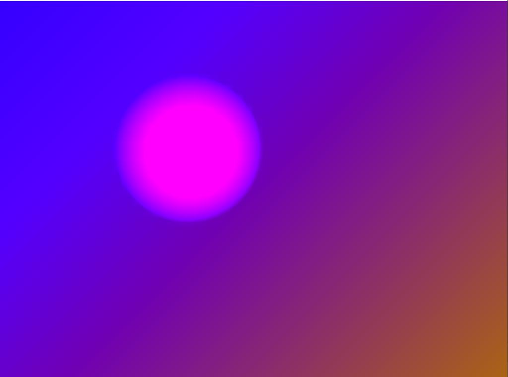
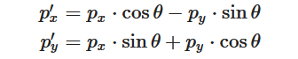
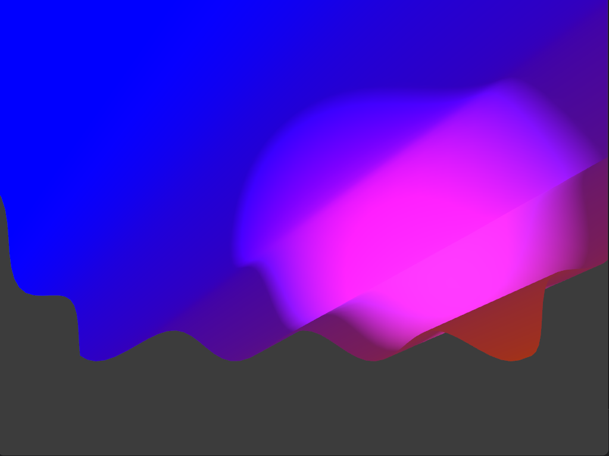
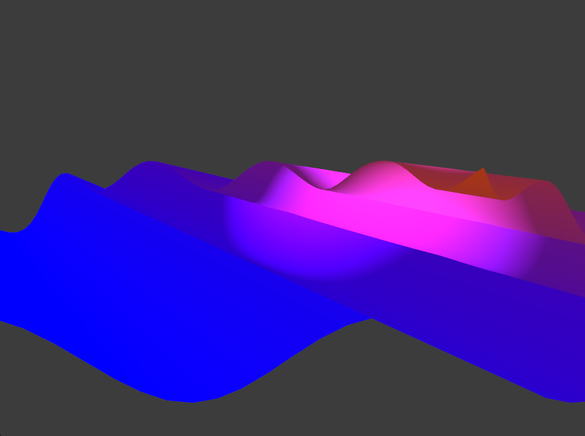

# Experiencia de aprendizaje 7: Gráficas

## Introducción
En esta unidad vas a interactuar con un dispositivo del computador que te permite pintar en pantalla a altas velocidades. Este dispositivo es la tarjeta gráfica o Graphics Processing Unit (GPU). La GPU es un dispositivo que se encarga de procesar y enviar señales de video a la pantalla del computador. Es un dispositivo especializado en procesar gráficos y video. Aunque actualmente también se usa, y mucho, para trabajar con inteligencia artificial y aprendizaje profundo.  
La idea de esta experiencia de aprendizaje es que te familiarices con los conceptos básicos de la programación de la GPU, es decir, que experimentes a nivel introductorio con **shaders** y que además veas cómo comunicar la CPU con la GPU para realizar aplicaciones interactivas.


## Actividad 1

#### ¿Qué son los vértices?
Es un punto en el espacio 3D, que contiene coordenadas (x,y,z).
**ChatGpt:** Tambien contiene informacion de colores, texturas, coordenadas UV, tangente y bitangente.

#### ¿Con qué figura geométrica se dibuja en 3D?
Triángulos.

**ChatGpt:** Si, es el triangulo ya que es la unidad mas pequeña que la GPU sabe dibujat.

#### ¿Qué es un shader?
Es un programa que se corre solo en la GPU y funciona para decirle al computador como dibujar en pantalla con luces y sombras.
**ChatGpt:** Ademas se escriben en lenguajes como GLSL, HLSL o Metal.

#### ¿Cómo se le llaman a los grupos de píxeles de un mismo triángulo?
Se les llama fragmentos.

**ChatGpt:** Cada fragmento representa un píxel potencial en la pantalla, pero aún no tiene color definitivo: el fragment shader se encarga de calcularlo (color, iluminación, transparencia, etc.).

#### ¿Qué es un fragment shader?
Uno de estos fragmentos de código de *GLSL*, que le pone el color final a los pixeles.

**ChatGpt:** Ademas un Fragment Shader (también llamado Pixel Shader) es un programa que se ejecuta en la GPU una vez por cada fragmento generado por la rasterización.

#### ¿Qué es un vertex shader?
Me suena a algo con vertices y por ser shader me imagino que es donde estan en la pantalla esos vertices.

**ChatGpt:**
-  Qué es: Un programa que procesa cada vértice en la GPU
- Qué hace: Transforma posiciones, calcula coordenadas y prepara datos para el fragment shader
- Cuándo se ejecuta: Antes de la rasterización (una vez por vértice)
- Lenguaje típico: GLSL, HLSL, ShaderLab

#### ¿Al proceso de determinar qué pixels del display va a cubrir cada triángulo de una mesh se le llama?
Resterización.

**ChatGpt:** Rasterización es el proceso mediante el cual la GPU convierte los triángulos 3D (hechos de vértices) en fragmentos 2D (píxeles en la pantalla).

#### ¿Qué es el render pipeline?
son los pasos que siguen el computador para mostrar en pantalla el render 2D de onjetos 3D.

**ChatGpt:** Se le llama pipeline (tubería) porque los datos fluyen de una etapa a otra, y cada etapa hace una tarea específica antes de pasar el resultado a la siguiente.

#### ¿Hay alguna diferencia entre aplicar un color a una superficie de una mesh o aplicar una textura?
creo que no hay diferencia ya que seria lo mismo osea colocar informacion o datos extras a un pixel, depronto cambien cositas por que la textura es mas amplio que un color ya que puede contener tamaño y tal pero siento que no existe diferencia.


**ChatGpt:**Cuando aplicas un color

👉 Estás asignando un solo valor de color uniforme (por ejemplo, rojo, azul, gris) a toda la superficie o a cada vértice de la malla.

🔸 Dos formas de hacerlo:

1. Color por material

    - Todo el objeto tiene el mismo color.

    - Ejemplo: un cubo completamente azul.

    - No necesita coordenadas UV ni textura.

    - Se define directamente en el material del shader (_Color, albedo, etc.).

2. Color por vértice (Vertex Color)

    - Cada vértice tiene un color asignado.

    - El shader interpola los colores entre vértices (creando gradientes).

    - Ejemplo: una esfera que pasa de rojo en la parte superior a azul en la inferior.

#### ¿Cuál es la diferencia entre una textura y un material?
Un material es la suma de varias texturas y otras cosas creo.

**ChatGpt:**Una textura es básicamente una imagen (como un .png, .jpg, .tga, etc.) que el shader usa para obtener información en cambio un material combina varias cosas:

🔹 Un shader (el programa que corre en la GPU para dibujar la superficie).

🔹 Una o varias texturas (opcional).

🔹 Parámetros numéricos (color base, brillo, transparencia, etc.).

#### ¿Qué transformaciones se requieren para mover un vértice del 3D world al View Screen?
Primero se coloca el objeto al mundo, luego del mundo a la camara, de la camara al clip y se escala en el viewports

**ChatGpt:**
Un vértice en 3D pasa por cuatro etapas principales de transformación:
`
Model Space → World Space → View (Camera) Space → Clip Space → Screen Space
`
#### ¿Al proceso de convertir los triángulos en fragmentos se le llama?
Es la rasterization la que se encargda de convertir los triangulos en fragmentos y ps los fragmentos son grupos de pixeles que provienen del mismo triangulo.

**ChatGpt:**¡Exacto! Al proceso de convertir los triángulos en fragmentos (o píxeles candidatos) se le llama 🟧 rasterización. Rasterización es la etapa del render pipeline donde la GPU toma los triángulos 3D ya transformados (por el vertex shader) y los convierte en fragmentos 2D, es decir, los píxeles que potencialmente aparecerán en pantalla.

#### ¿Qué es el framebuffer?
Es la liena de datos que se envian las display en pantalla

**ChatGpt:**

#### ¿Para qué se usa el Z-buffer o depth buffer en el render pipeline?
se usa para saber que items u objetos van detras de otro o adelante.

**ChatGpt:**El Z-buffer (también llamado depth buffer) es una memoria auxiliar dentro del framebuffer que almacena la profundidad (distancia al observador) de cada píxel o fragmento.

### Luego de ver el segundo video entiendes por qué la GPU tiene que funcionar tan rápido y de manera paralela. ¿Por qué?
El trabajo en paralelo es nada más una cuestión de que la GPU necesita realizar muchísimos cálculos al mismo tiempo y en escencia es esto para lo que esta echa. ¿por que? ya que el jugador la idea es que tome decisiones en tiempo real el feedback visual tiene que ser igual de rapido o mas a la reaccion de las personas.

## Actividad 02

Despues de modificar el codigo con esta parte en `draw()`

```cpp
void ofApp::draw(){
    ofSetColor(255);

    //shader.begin();

    ofDrawRectangle(0, 0, ofGetWidth(), ofGetHeight());

    //shader.end();
}
```

vemos que cuando corremos el programa solo se dibuja una pantalla en blanco, algo muy basico, pero cuando corremos el codigo original (osea con el `shader.begin()` y el `shader.end()`) nos damos cuenta que se generan unos colores con un difuminado.

### ¿Cómo funciona?

El codigo de draw() en el codigo original lo que hace es cargar los archivos shaders y ps desde el principio se dibuja el fondo blanco para luego crear un rectangulo pero como comenzamos nuestro shader para por el vertex shader y por el fragment shader, en nuestro caso el `shader.vert` me va a transformar los vértices con la modelViewProjectionMatrix, y el `shader.frag` me va a calcula el color de cada fragmento usando las coordenadas de la pantalla. 

### ¿Qué resultados obtuviste?

Obtuve una imagen con varios degradados de diefrentes color mas que todo azules y rosados. este efecto lo genera el `shader.frag` que ayuda a que cada "pixel" tenga un color diferente segun la posicion pero creo que estoy respondiendo la cuasrta pregunta xd.


### ¿Estás usando un vertex shader?

Si lo estamos usando aunque no me queda muy claro para que chat me ayudo un poco a entender mejor:

Este vertex shader toma cada vértice 3D y lo transforma para proyectarlo correctamente en la pantalla usando la matriz modelo-vista-proyección.

Analogia:
Imagina que estás mirando una maqueta 3D:

- La model matrix coloca el objeto en el lugar correcto.

- La view matrix representa desde dónde miras (la cámara).

- La projection matrix convierte esa escena 3D en una imagen 2D en perspectiva.

La multiplicación MVP * posición hace todo eso por ti 🔄

### ¿Estás usando un fragment shader?

Si, lo estamos usando para darle el color a los pixeles en pantalla, y se usa la posicion para esto, como podemos ver en la esquina izquierda abajo, es azul y entre mas  a la derecha mas rojo y arriba mas blanco.

Cuando ejecutas este shader:

La esquina inferior izquierda es azul puro (r=0, g=0, b=1).

A medida que te mueves a la derecha, el rojo aumenta.

A medida que te mueves hacia arriba, el verde aumenta.

En la esquina superior derecha, el color es blanco azulado (r=1, g=1, b=1).


## Actividad 03

Ahora vas a pasar información personalizada de tu programa a los shaders. Vas a leer con detenimiento el tutorial Adding Uniforms.

### ¿Qué es un uniform?

Es una variable global que se envia a la GPU para que pueda dibujar cosas que cambian, y es de solo lectura, y se mantiene durante toda la ejecucion de un draw call.
> Un uniform es una forma de enviar datos desde la CPU (C++) al shader (GPU).

**En resumen:**

shader.setUniform1f("time", value) - C++ (CPU) - Envía un valor a la GPU


uniform float time; - GLSL (Shader) - Recibe y usa ese valor dentro del shader

### ¿Cómo funciona el código de aplicación, los shaders y cómo se comunican estos?

La aplicacion me dibuja un plano de vertices, el plano se define en la parte del setup() y es ahi mismo donde se dan las condiciones, luego en draw se definen los ofColor y por medio del metodo ofsetColor se cambia la variable global color, y se le da el valor de colormix, luego se corren los shader y vemos que se crea uno con el nombre de tiempo, dentro del shader.vert podemos observar que se crea un uniform de tipo float llamado time, que va hacer el encargado de contar desde que se inicio el progama y me va a servir para poder generar el movimiento de seno, luego dentro del main modificamos las variables, `displacementY` y `displacementHeight` y se lo pasamos al programa para que haga la gestion del MVP y lo dibuje, como vemos en este codigo es mas importante y relevante el shader.vert que el shader.frag ya que en este solo se crea el globalColor, tambien vamos a definir en el draw lo que hace que mi plano cambie de color dependiendo de donde este el mouse en el eje X.


**Modifica el código de la actividad para cambiar el color de cada uno de los píxeles de la pantalla personalizando el fragment shader.**
```glsl
OF_GLSL_SHADER_HEADER

uniform vec4 globalColor;
uniform float time;
out vec4 outputColor;
 
void main()
{
	float r = abs(sin(time * 0.1));
	float g = abs(sin(time * 0.8));
	float b = abs(sin(time * 1.1));
    outputColor = vec4(r,g,b, 1.0) * globalColor;
}

```

lo que hace es que hace que mis variables de r, g y b van a cambiar cada ves que la variable tiempo cambie y va a quedar entre valores de 1 y 0 gracias al abs(sin(...)), ya que el sen es periodico y me da valores entre 1 y -1 y con el abs (valor absoluto), se recorta este rango a 1 y 0 lo que hace que con el tiempo los colores de mis lineas cambien.


## Actividad 04

### ¿Qué hace el código del ejemplo?

El codigo lo que hace es que me dibuja vertices 2D de distintos colores, todos tienen la misma forma, y tiene una funcion que hace que segun la posicion del mouse se mueva la imagen generada en el angulo X, el dibujo no se genera en todo el tamaño de la pantaña ya que tiene un delimitador para poder dar el efecto de `scroll` al mover el mouse por el eje X.

### ¿Cómo funciona el código de aplicación, los shaders y cómo se comunican estos?

primero tenemos un `ofDisableArbTex();` que es para tener coordenadas de textura si se lo quitamos aparece este error.


Luego cargamos la imagen y configuramos la textura para que se repita si las coordenadas UV exceden el rango [0,1]: 

```cpp
if(img.load("img.jpg")) {
		img.getTexture().setTextureWrap(GL_REPEAT, GL_REPEAT);
	}
```


Luego creamos el plano con los vertices y `mapTexCoords()` asigna coordenadas de textura que encajan con el tamaño real de la imagen.

Y ahora vamos a la parte buena la funcion `draw()` que es la encargada de crear todo el vizual que vamos a realizar almenos la parte de c++. Primero analizamos estas dos lineas de codigo: 

```cpp
img.getTexture().bind();

shader.begin();
```
Primero con el `.bind()` este  hace que la textura este disponible para el shader como `uniform sampler2D tex0;`, y `shader.begin()`se encarga es de cargar el shader y como habiamos entendido desde la actividad pasada todo lo que se dibuje despues de esa linea usara las transformaciones y efectos que propone el shader.


Listo ahora lo que hace el codigo es que primero me organiza la variable que le vamos a mandar al shader y luego enviamos dos datos al shader por medio del uniform que son variables globales que pasan de C++ a GLSL:

```cpp
float mousePosition = ofMap(mouseX, 0, ofGetWidth(), 1.0, -1.0, true);
mousePosition *= plane.getWidth();

shader.setUniform1f("mouseX", mousePosition);
shader.setUniform2f("resolution", ofGetWidth(), ofGetHeight());
```
Y ps el `setUniform2f("resolution", ofGetWidth(), ofGetHeight());` lo que le pasa es como el tamaño de pantalla que va a utilizar el shader.

Y ya dibujamos el plano con la matriz `ofPushMatrix();` y ya con este resto de codigo:
```cpp
ofTranslate(ofGetWidth()/2, ofGetHeight()/2);

plane.draw();

ofPopMatrix();

shader.end();

img.getTexture().unbind();
```

Aqui movemos el origen al centro de la pantalla y luego dibujamos el plano con la textura y shader activos, y `ofPopMatrix();` me devuelve mi matriz en el estado anterior  y luego cierra o termina el sahder y desabilita las texturas.

Ahora vamos a entender los shader empecemos con el shader.vert:
```cpp
OF_GLSL_SHADER_HEADER

// these are for the programmable pipeline system and are passed in
// by default from OpenFrameworks
uniform mat4 modelViewProjectionMatrix;

in vec4 position;
in vec2 texcoord;

// this is something we're creating for this shader
out vec2 texCoordVarying;

// this is coming from our C++ code
uniform float mouseX;

void main()
{
    // here we move the texture coordinates
    texCoordVarying = vec2(texcoord.x + mouseX, texcoord.y);

    // send the vertices to the fragment shader
	gl_Position = modelViewProjectionMatrix * position;
}
```
tenemos 2 variables que son entradas que son position y textcoord encargadas de la posicion de cada vertice en el plano y textcoord se encarga de las coordenadas de textura (UV) del vertice.

Y una variable de salida out que pasa las coordenadas de textura actualizadas, ademas del uniform que pasamos desde el cpp que es la de mouseX, y ya en el `main()` lo que hace es que mueve la textura, ya que no se mueve fisicamente el vertice en el espacio 3D solo la textura.

y el shader.frag funciona de esta manera:

```cpp
OF_GLSL_SHADER_HEADER

// this is how we receive the texture
uniform sampler2D tex0;
uniform vec2 resolution;

in vec2 texCoordVarying;

out vec4 outputColor;
 
void main()
{
    outputColor = texture(tex0, texCoordVarying / resolution);
}
```

Se encarga de las texturas y los colores de el programa. 


### Realiza modificaciones a ofApp.cpp y al vertex shader para conseguir otros comportamientos.

Lo que hice fue modificar el codigo para que mover el mouse en Y tambien cambien las visuales y la textura se pueda mover en el eje Z:

Modificamos el ofApp.cpp:
```cpp
void ofApp::draw() {
	img.getTexture().bind();

	shader.begin();

	// --- Movimiento en X (ya existente) ---
	float mousePositionX = ofMap(mouseX, 0, ofGetWidth(), 1.0, -1.0, true);
	mousePositionX *= plane.getWidth();

	// --- Nuevo: movimiento en Y ---
	float mousePositionY = ofMap(mouseY, 0, ofGetHeight(), 0.0, 1.0, true);

	shader.setUniform1f("mouseX", mousePositionX);
	shader.setUniform1f("mouseY", mousePositionY);
	shader.setUniform2f("resolution", ofGetWidth(), ofGetHeight());

	ofPushMatrix();
	ofTranslate(ofGetWidth() / 2, ofGetHeight() / 2);
	plane.draw();
	ofPopMatrix();

	shader.end();
	img.getTexture().unbind();
}
``` 
y el shader.vert:
```cpp
OF_GLSL_SHADER_HEADER

uniform mat4 modelViewProjectionMatrix;

in vec4 position;
in vec2 texcoord;

out vec2 texCoordVarying;

// valores que vienen del C++
uniform float mouseX;
uniform float mouseY;

void main() {
    vec4 pos = position;

    // Movimiento vertical + escala según el mouseY
    float scale = 1.0 + mouseY * 1.5;  // escala del plano
    pos.xyz *= scale;
    pos.z += mouseY * 300.0;           // desplazamiento en Z

    // Mueve las coordenadas de textura en X
    texCoordVarying = vec2(texcoord.x + mouseX, texcoord.y);

    gl_Position = modelViewProjectionMatrix * pos;
}
```
## Realiza modificaciones al fragment shader para conseguir otros comportamientos.

Aqui vamos a modificar el color de la textura a algo mucho mas verdoso para que el shader.frag pueda trabajar en cambiarle el color a la textura, para esto nos referenciamos de que numeros en el `RGB` nos sirven para darle un color mucho mas verde y azul al plano, primero vamos a reducir el rojo como multiplocarlo por un numero como 0.2, 0.9 etc, vamos a aumentar el verde y el azul esos si multiplicandolos por numeros como 1.5 o parecidos.

De esta manera:
```cpp
OF_GLSL_SHADER_HEADER

uniform sampler2D tex0;
uniform vec2 resolution;

in vec2 texCoordVarying;
out vec4 outputColor;

void main()
{
    vec2 uv = texCoordVarying / resolution;
    vec4 texColor = texture(tex0, uv);

    texColor.r *= 0.6;  
    texColor.g *= 1.2;  
    texColor.b *= 1.6;  

    outputColor = texColor;
}

```

Asi le pasamos al òutputColor los datos de texColor modificados para tener tonos mas verdes.

## Reto 

Ahora si voy a empezar el reto lo que quiero hacer es modificar el ejemplo 3 por que la verdad no supe como modificar ni cambiar la imagen de la textura del ejemplo 4. 
Comence queriendo pintar el fondo o mejor dicho el plano para que tenga colores vivos y que cambien como estaban cambiando las lineas que unian a los vertices.

Por lo que comence a cambiar el shader.vert y agregandole cosas nuevas como:

```cpp
    float gradient = (position.x + position.y) ;
    vec4 baseColor = mix(mouseColor, vec4(mouseColor.b, mouseColor.r, mouseColor.g, 1.0), gradient);

    vColor = baseColor ;

    gl_Position = modelViewProjectionMatrix * pos;
```
generando un efecto como el siguiente:






y esos diferentes colores son por las posiciones del mouse pero quiero que se vea mucho mas el circulo que teniamos funcionando en el ejemplo, ya que se pierde en el color del plano, tengamos en cuenta que la variable que le estamos pasando al shader es vColor por esto el fondo cambia de color.

Bueno pensando en como realizariamos para que se viera un poco mas lo que dispersa el radio del mouse probe multiplicar `float gradient = (position.x + position.y);` por `0.001` ya reduce la escala para que el gradiente no cambie tan rápido, y genera un efecto aun ams bonito:




Ok, continuando con lo que queria hacer que era la intencidad del radio del mouse, aqui s use algo de ia por que no sabia como realizar para que el alpha solo en el radio se aumentara sin subirle todo el alpha al dibujo y gpt añadio estas lineas:
```cpp
float intensity = 1.0 - smoothstep(0.0, mouseRange, dist);
vColor = baseColor * (0.3 + 1.7 * intensity);
```
Esta es la repuesta de ChatGPT:

- ***Si dist = 0 (muy cerca del mouse) → smoothstep = 0 → intensity = 1 → más brillante.***

- ***Si dist = mouseRange → smoothstep = 1 → intensity = 0 → normal o apagado.***

***Si dist = mouseRange → smoothstep = 1 → intensity = 0 → normal o apagado.***

Y la segunda linea `vColor = baseColor * (0.3 + 1.7 * intensity);` Se refiere a que el `0.3` la lejania en la que si esta lejos del mouse va a ser mas oscuro y el `2.0` es si esta cerca el color se intensifica casi el doble.

y le pasamos un alpha de uno para tener opacidad completa:
```cpp
  vColor.a = 1.0; 
```

y obtenemos un efectoa asi:


Y ahora lo que hice fue agregarlo un movimiento de sen(), la cosa es que no se me movia el plano, y ps lo que me di cuenta era que no tenia camara entonces la agregue.

Ahora el profe nos puso el reto de hacer rotar el plano algo que creo que se haria facil con trigonometria ya que toca es cambiar de posicion cada vertice en el plano como si fuera un punto en el plano, y estos tienen que seguir cambiando mientras transcurre el tiempo, por lo que primero tenemos que hacer que el angulo dependa del tiempo y cambie mientras este corre.(Lo puse a rotar en X, por lo que su tienen que mover es en `z` y `y`)

Ya lo probe y se mueve super lento por lo que opte multiplicar el tiempo por 40 para que se subiera mas el rango de cambio.

Y creamos dos variables `c` y `s` que van a ser el cos y sen al cual le ponemos el angulo que cambia segun el tiempo. 

Luego consultamos y vemos que esta es la formula si queremos rotar un punto entorno a un eje y nos encontramos con esto:



Asi que escribiremos estas ecuaciones en code y luego le pasamos las cordenadas nuevas al pos.y y pos.z:

```cpp
 float angle = radians(time*40f); // velocidad de rotación
    float c = cos(angle);
    float s = sin(angle);

    
    float Yprima = pos.y * c - pos.z * s;
    float Zprima = pos.y * s + pos.z * c;
    pos.y = Yprima;
    pos.z = Zprima;
```

Y podemos ver como el plano rota:




Y asi queda nuestro codigo del shader.vert:

```cpp
OF_GLSL_SHADER_HEADER

uniform mat4 modelViewProjectionMatrix;
in vec4 position;

uniform float mouseRange;
uniform vec2 mousePos;
uniform vec4 mouseColor;

out vec4 vColor;
uniform float time;

void main()
{
    vec4 pos = position;

   
    vec2 dir = pos.xy - mousePos;
    float dist = length(dir);

    if (dist > 0.0 && dist < mouseRange) {
        float distNorm = 1.0 - (dist / mouseRange);
        dir *= distNorm;
        pos.x += dir.x;
        pos.y += dir.y;
    }

   
    float amplitude = 40.0;
    float frequency = 0.02;
    pos.z += sin((pos.x + pos.y) * frequency + time * 2.0) * amplitude;

 
    float angle = radians(time*40f); // velocidad de rotación
    float c = cos(angle);
    float s = sin(angle);

    
    float Yprima = pos.y * c - pos.z * s;
    float Zprima = pos.y * s + pos.z * c;
    pos.y = Yprima;
    pos.z = Zprima;


    float gradient = (position.x + position.y) * 0.001;
    vec4 baseColor = mix(mouseColor, vec4(mouseColor.b, mouseColor.r, mouseColor.g, 1.0), gradient);

    float intensity = 1.0 - smoothstep(0.0, mouseRange, dist);
    vColor = baseColor * (0.7 + 1.7 * intensity);
    vColor.a = 1.0;

    gl_Position = modelViewProjectionMatrix * pos;
}

```